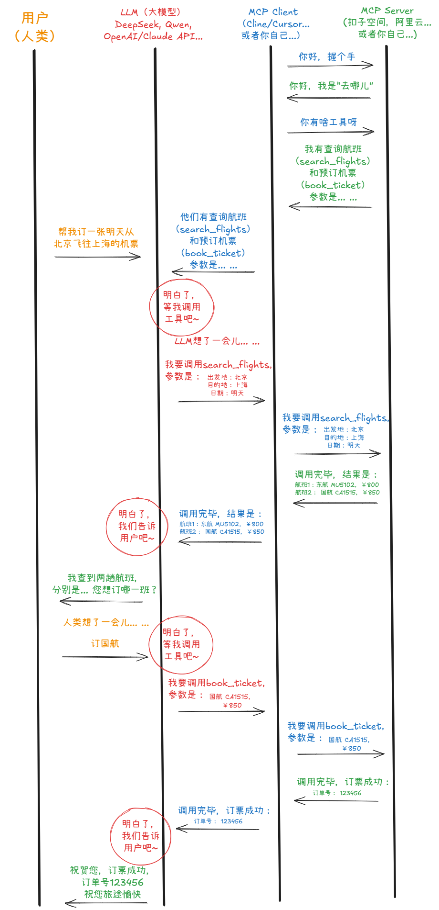

## MCP-WORKING-DEMO

The `Model Context Protocol (MCP)` is an open standard, proposed by Anthropic, designed to enable AI models, particularly Large Language Models (LLMs), to interact with the real world. Its purpose is to allow AI to access external data and perform real-world actions, moving them beyond just generating text.

## How It Works

MCP acts as a universal interface between an AI model and external tools (like databases, APIs, or filesystems). It uses a `client-server` architecture:

- An `MCP Client`, which is integrated into the AI application, sends a request to a server in a standardized format.

- An `MCP Server` acts as a tool adapter. It receives the request, translates it into the necessary commands for a specific tool (e.g., a calendar API), executes the action, and then sends a structured response back to the AI.

This standardizes how an AI connects to various tools, eliminating the need for custom, one-off integrations for every service.

## MCP Diagram

(MCP handshake diagram)

## MCP Links

- [MCP GitHub](https://github.com/modelcontextprotocol)
- [MCP Documentation](https://modelcontextprotocol.io/docs/getting-started/intro)
- [MCP Specification](https://modelcontextprotocol.io/specification/2025-06-18)
